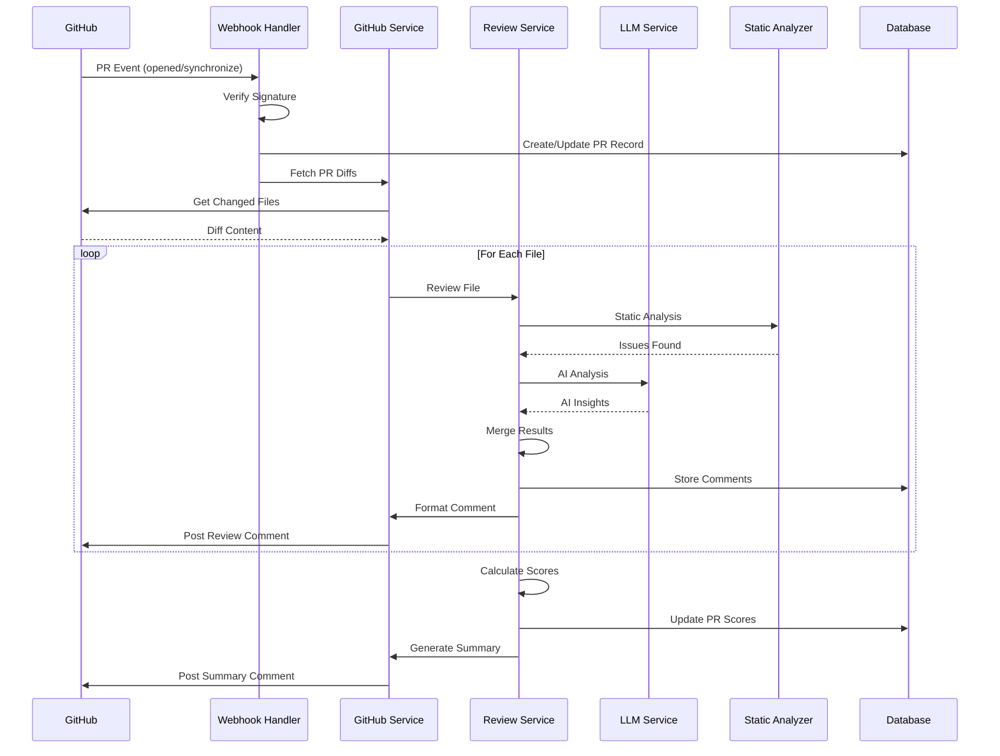
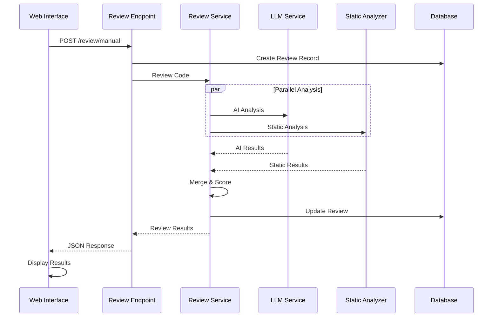

# System Architecture

## Overview

The AI-Powered GitHub Pull Request Reviewer is a FastAPI-based application that combines LLM reasoning with static code analysis to provide comprehensive code reviews.

## Architecture Diagram

```mermaid
graph TB
    subgraph "External Services"
        GH[GitHub API]
        LLM[LLM Provider<br/>OpenAI/Anthropic/Google]
    end
    
    subgraph "API Layer"
        WH[Webhook Endpoint]
        MR[Manual Review Endpoint]
        AUTH[Auth Endpoints]
    end
    
    subgraph "Service Layer"
        GHS[GitHub Service]
        RS[Review Service]
        LLMS[LLM Service]
        SA[Static Analyzer]
    end
    
    subgraph "Data Layer"
        DB[(SQLite Database)]
    end
    
    subgraph "Frontend"
        UI[Web Interface]
    end
    
    GH -->|Webhook Events| WH
    UI -->|Manual Review| MR
    GH -->|OAuth| AUTH
    
    WH --> GHS
    MR --> RS
    
    GHS --> RS
    RS --> LLMS
    RS --> SA
    
    LLMS --> LLM
    GHS --> GH
    
    WH --> DB
    MR --> DB
    AUTH --> DB
    
    style GH fill:#24292e
    style LLM fill:#6366f1
    style DB fill:#10b981
```



## Component Details

### 1. API Layer

#### Webhook Endpoint (`/webhook/github`)
- Receives GitHub PR events
- Verifies webhook signatures
- Triggers automated reviews
- Posts results back to GitHub

#### Manual Review Endpoint (`/review/manual`)
- Accepts code snippets directly
- Returns immediate review results
- No GitHub integration required

#### Auth Endpoints (`/auth/*`)
- GitHub OAuth flow
- JWT token generation
- User session management

### 2. Service Layer

#### GitHub Service
- **Responsibilities:**
  - Fetch PR diffs
  - Parse changed files
  - Post review comments
  - Manage GitHub API interactions
- **Key Methods:**
  - `get_pr_diff()`: Extract file changes
  - `post_review_comment()`: Add inline comments
  - `detect_language()`: Identify programming language

#### Review Service
- **Responsibilities:**
  - Orchestrate review process
  - Combine LLM + static analysis
  - Format review comments
  - Generate summary reports
- **Key Methods:**
  - `review_code()`: Main review logic
  - `review_diff()`: Review git diffs
  - `format_review_comment()`: Human-readable output

#### LLM Service
- **Responsibilities:**
  - Interface with AI providers
  - Prompt engineering
  - Response parsing
  - Error handling
- **Supported Providers:**
  - OpenAI (GPT-4)
  - Anthropic (Claude)
  - Google (Gemini)

#### Static Analyzer
- **Responsibilities:**
  - AST-based analysis
  - Pattern matching
  - Language-specific rules
- **Languages Supported:**
  - Python (AST parsing)
  - JavaScript/TypeScript (heuristics)
  - Java (heuristics)

### 3. Data Layer

#### Database Schema

```sql
-- Users table
CREATE TABLE users (
    id INTEGER PRIMARY KEY,
    github_id INTEGER UNIQUE,
    username VARCHAR,
    access_token VARCHAR,
    created_at TIMESTAMP
);

-- Repositories table
CREATE TABLE repositories (
    id INTEGER PRIMARY KEY,
    user_id INTEGER REFERENCES users(id),
    github_repo_id INTEGER UNIQUE,
    full_name VARCHAR,
    is_active BOOLEAN
);

-- Pull Requests table
CREATE TABLE pull_requests (
    id INTEGER PRIMARY KEY,
    repository_id INTEGER REFERENCES repositories(id),
    pr_number INTEGER,
    status VARCHAR,
    overall_score FLOAT,
    correctness_score FLOAT,
    performance_score FLOAT,
    readability_score FLOAT,
    maintainability_score FLOAT
);

-- Review Comments table
CREATE TABLE review_comments (
    id INTEGER PRIMARY KEY,
    pull_request_id INTEGER REFERENCES pull_requests(id),
    file_path VARCHAR,
    line_number INTEGER,
    severity VARCHAR,
    category VARCHAR,
    comment_text TEXT
);

-- Feedback table (for learning)
CREATE TABLE feedback (
    id INTEGER PRIMARY KEY,
    comment_id INTEGER REFERENCES review_comments(id),
    feedback_type VARCHAR,
    code_changed BOOLEAN
);
```

## Data Flow

### GitHub Webhook Flow



### Manual Review Flow



## Scoring Algorithm

Each review generates scores in 4 dimensions:

1. **Correctness** (0-10)
   - Logical errors
   - Edge case handling
   - Type safety

2. **Performance** (0-10)
   - Algorithm complexity
   - Resource usage
   - Optimization opportunities

3. **Readability** (0-10)
   - Code clarity
   - Naming conventions
   - Documentation

4. **Maintainability** (0-10)
   - Code structure
   - Modularity
   - Test coverage

**Overall Score** = Average of all dimensions

## Learning Loop

The system tracks user feedback to improve:

1. **Comment Reactions**: Track which comments lead to code changes
2. **PR Outcomes**: Monitor accepted vs. rejected PRs
3. **Confidence Calibration**: Adjust confidence thresholds based on accuracy

Future enhancement: Fine-tune models on historical data.

## Security Considerations

- **Webhook Verification**: HMAC signature validation
- **OAuth Tokens**: Encrypted storage
- **JWT Secrets**: Environment-based configuration
- **Rate Limiting**: Prevent API abuse (TODO)
- **Input Validation**: Pydantic schemas

## Scalability

Current limitations (MVP):
- SQLite (single-file database)
- Synchronous processing
- No queue system

Production improvements:
- PostgreSQL with connection pooling
- Celery for async task processing
- Redis for caching
- Load balancer for multiple instances

## Deployment

### Docker
```bash
docker-compose up -d
```

### Manual
```bash
uvicorn app.main:app --host 0.0.0.0 --port 8000
```

### Environment Variables
See `.env.example` for required configuration.
